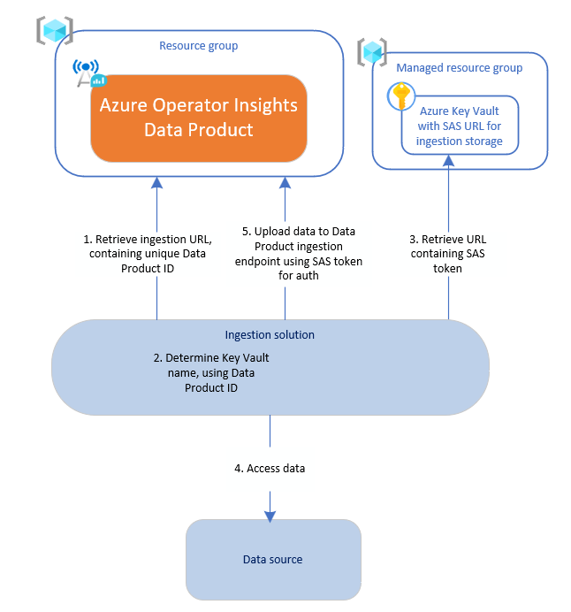

# How to ingest data into an Azure Operator Insights Data Product

Data ingestion is a crucial process for any Data Product. Whether you’re dealing with real-time streams or batch uploads, a well-designed ingestion solution ensures smooth data flow. Understanding the steps involved in designing an ingestion solution will allow you to easily adapt the code samples in this repository, or build your own ingestion solution from scratch.

In this article:

- [Steps to implement ingestion for a Data Product](#steps-to-implement-ingestion-for-a-data-product)
  - [Plan how to access the source data](#plan-how-to-access-the-source-data)
  - [Determine requirements for uploaded data](#determine-requirements-for-uploaded-data)
  - [Implement the upload code](#implement-the-upload-code)
  - [Handle SAS URL rotation](#handle-sas-url-rotation)
  - [Test the ingestion solution](#test-the-ingestion-solution)
  - [Implement extra function](#implement-extra-function)
- [Hints and tips](#hints-and-tips)

## Steps to implement ingestion for a Data Product

### Plan how to access the source data

Identify your data source and decide how your ingestion solution will access the data. For simplicity, most of the samples in this repository read files from a local filepath, but some examples read files from an Azure Storage Account. Other data sources might produce continuous streams of data.

Consider the following:

- **Deployment location:** Will the ingestion solution run on-premises or in Azure?
- **Data flow:** Does the data source push data to your ingestion solution, or should the ingestion solution pull from the data source?
- **Frequency:** Will the ingestion solution run continuously, or upload batches of data on a schedule?
- **Authentication:** How will the ingestion solution authenticate with the data source?
- **Throughput:** What data rate must the ingestion solution handle?

### Determine requirements for uploaded data

For all Data Products, you must upload data to the correct Azure Storage Account container for the associated data type. The container name is usually the same as the data type name.

In addition, depending on the Data Product, there might be specific requirements on the filepath or format of the data that you upload.

Check the documentation for your Data Product to find out which container names to use, and whether any additional requirements apply to you.

If the ingestion solution does not meet these requirements, data won't be processed correctly by the Data Product.

### Implement the upload code

Now you can write your end-to-end ingestion solution.

Ingestion solutions perform 5 main steps:

1. **Obtain the Data Product ingestion URL:** Query the Data Product resource to obtain the ingestion URL, which contains the unique ID for the Data Product. The URL format is `https://aoiingestiondp123abc.blob.core.windows.net` where `dp123abc` represents the Data Product ID.
2. **Identify the managed Key Vault:** Determine the name of the managed Key Vault associated with the Data Product. It follows the pattern `aoi-<dataProductId>-kv`, where `<dataProductId>` corresponds to the ID from step 1.
3. **Retrieve the ingestion SAS URL:** Query the Key Vault identified in step 2 to get the ingestion SAS URL for the Data Product. This URL is the Data Product's ingestion URL, with a SAS token appended. For example, `https://aoiingestiondp123abc.blob.core.windows.net?sv=2021-12-02&ss=b&srt=co&spr=https,http&st=2024-02-16T20%3A18%3A02Z&se=2024-05-16T20%3A17%3A57Z&sp=rwdl&sig=<REDACTED>`
4. **Read from the data source:** Collect the data to upload, as you planned in [Plan how to access the source data](#plan-how-to-access-the-source-data).
5. **Upload data to the ingestion endpoint:** Use the SAS token obtained in step 3 to authenticate. The ingestion endpoint is an Azure Storage Account, so most methods of uploading data to an Azure Storage Account will also work with the Data Product ingestion endpoint. Make sure to upload the data to the correct Azure Storage Account container for the data type.

Steps 1-3 are setup steps which can be carried out once, then the SAS token can be reused for as long as it is valid.

### Handle SAS URL rotation

The SAS token can be used until it is revoked or its expiry date has passed. When the SAS token is rotated, the Data Product automatically updates the value of the `input-storage-sas` secret in the managed Key Vault.

To ensure uninterrupted service, your ingestion solution should frequently retrieve the input-storage-sas secret from the managed Key Vault. This ensures it always uses the latest SAS token. For example, fetch the secret at the start of scheduled upload runs or hourly for continuous ingestion solutions. If an authentication error occurs, re-fetch the secret, as it may indicate the old SAS token has been revoked.

### Test the ingestion solution

Use your ingestion solution to upload sample data to the Data Product, and identify and fix any errors.

Use [Data product resource logs](https://learn.microsoft.com/en-us/azure/operator-insights/monitor-operator-insights#resource-logs-for-data-products-overview-collection-and-analysis) to look for errors uploading the data to the ingestion storage account, and errors processing the data after it is uploaded.

- Logs related to upload of data to the Data Product are in the `AOIStorage` table, with categories `Ingestion` and `IngestionDelete`.
- Logs related to processing of uploaded data are in the `AOIDigestion` table, with category `Digestion`.

Once data has been successfully uploaded and processed, you can [explore the data using the Data Product's consumption URL](https://learn.microsoft.com/en-us/azure/operator-insights/data-query).

### Implement extra function

Once your basic ingestion solution is working, you can implement extra function to make it suitable for production use.

For example:

- Add logging and metrics so you can monitor the performance of the ingestion solution and debug issues.
- Add retries in case of transient connection errors between the ingestion solution and the data source, or the Data Product.
- Optionally, filter data before uploading to the Data Product.
- Optionally, transform data before uploading to the Data Product, e.g. to remove personally identifiable information (PII).

## Hints and tips

- **File modification:** Avoid modifying or moving uploaded files (blobs) after they have been uploaded to the Data Product. The Data Product processes the initial version of the blob on upload, and changes in subsequent versions might not be processed, leading to missing data. If you move or rename a blob post-upload, it's treated as a new blob, which can result in duplicated data.

- **Directory depth:** When uploading data files, ensure they are at least two directories deep within the ingestion storage account. For example, if you're uploading a file called `mydata.csv`, place it in a path like `{directory-name}/{sub-directory-name}/mydata.csv`.

- **Blob storage vs data lake ingestion endpoints:**
  - You have two options for the Data Product ingestion URL: one for the blob storage endpoint (e.g. `https://aoiingestiondp123abc.blob.core.windows.net`), and one for the data lake storage endpoint (e.g. `https://aoiingestiondp123abc.dfs.core.windows.net`).
  - Choose the endpoint that best suits your ingestion method. For example, AzCopy can use the blob storage endpoint, but Azure Databricks requires the data lake endpoint. To obtain the data lake endpoint URL, simply replace `blob` in the ingestion URL with `dfs`.
  - Use the appropriate API calls for the endpoint you have chosen:
    - [Azure Blob Storage REST API](https://learn.microsoft.com/en-us/rest/api/storageservices/blob-service-rest-api).
    - [Azure Data Lake Storage Gen2 REST APIs](https://learn.microsoft.com/en-us/rest/api/storageservices/data-lake-storage-gen2).
  - For more information on storage account endpoints, see [Azure Storage Account standard endpoints](https://learn.microsoft.com/en-us/azure/storage/common/storage-account-overview#standard-endpoints).
