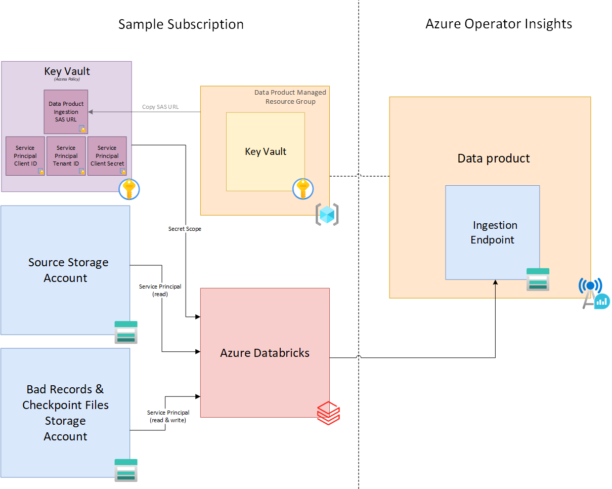

# Ingestion using Azure Databricks

## When to use Azure Databricks to ingest in to Azure Operator Insights

Azure Databricks provides a convenient solution for ingesting from a variety of data sources directly in to an [Azure Operator Insights data product](https://learn.microsoft.com/en-us/azure/operator-insights/).

Using Databricks is recommended if:

- The data source is supported by Azure Databricks
  - For information about connecting to other supported data sources, see [Azure Databricks documentation/Connect to data sources (MS Learn)](https://learn.microsoft.com/en-us/azure/databricks/connect/)
- You require continuous ingestion
- The data you would like to ingest contains a transaction log (E.g. Delta file format)
  - In this scenario, your databricks ingestion workflow can convert to a file format that Azure Operator Insights supports
- You wish to apply transformations or filtering to your data before it is ingested to your data product

### Authentication to Azure Operator Insights

**Azure Databricks does not currently support reading the SAS URL directly from the Data Product's Key Vault.** This is because the Data Product's Key Vault uses the Role-Based Access Control (RBAC) Permission model, which is unsupported by Azure Databricks

The recommended approach of providing the SAS URL (and other secrets) to Azure Databricks is to _use an Azure Key Vault-backed secret scope with a Key Vault that has the 'Access policy' Permission model._

[Create an Azure Key Vault-backed secret scope (MS Learn)](https://learn.microsoft.com/en-us/azure/databricks/security/secrets/secret-scopes#--create-an-azure-key-vault-backed-secret-scope) describes how to do this

After the secret scope is created, _copy the SAS URL from the Data Product's Key Vault to the Databricks 'Access Policy' keyvault_ such that its value can be accessed from a Databricks job. Any other secrets required by the job can also be stored and accessed from the same Key Vault.

#### How to Copy the ingestion SAS URL to the 'Access Policy' key vault

  1. Find the resource group which contains the managed Key Vault for the data product. This Key Vault contains the SAS URL for ingesting files in to Azure Operator Insights.
      - The resource group has a naming convention of `<data-product-name>-HostedResources-<unique-hex-string>`
      - This can be found in the Azure portal by searching for your data product name
  1. Open the managed key vault within the resource group and navigate to the `Secrets` tab
      - The key vault has a naming convention of `aoi-dp<unique-id>-kv`
  1. Find the secret named `input-storage-sas`
      - You will need at least the `Key Vault Secrets User` role on the Key Vault to view the value of the secret
  1. Create a new secret in the _Access policy Key Vault_, created in the previous steps
  1. Copy the value of the `input-storage-sas` secret in the managed key vault to the new secret in the _Access policy Key Vault_. Click the `Create` button to save the new secret

> **Important**: The SAS URL will not be automatically updated in the *'Access policy' Key Vault_ when it is rotated. This will cause your Databricks ingestion job to fail when the initial SAS URL expires. The default expiry time for ingestion SAS URLs is 3 months.
To avoid this, **the new SAS URL must be uploaded to the _'Access policy Key Vault'_ when it is rotated**.

## Ingestion sample notebook

To get started, a [sample ingestion notebook](databricks-aoi-ingestion.py) is provided. The sample notebook is used to create a Databricks job that reads Delta files from an Azure Storage Account container, filters and converts them to CSV, and ingests them in to Azure Operator Insights.

### How to use the sample notebook

[The sample ingestion notebook](./databricks-aoi-ingestion.py) is a reference to be used along side the [Azure Databricks documentation (MS Learn)](https://learn.microsoft.com/en-us/azure/databricks/) to create an ingestion solution which fits your requirements.

Details of the environment in which the sample notebook is intended to run are provided below

### Diagram

The diagram shows 

### Environment

- Data to be ingested exists in [Delta format](https://learn.microsoft.com/en-us/azure/databricks/structured-streaming/delta-lake) in an Azure Storage Account container
- A separate Storage Account exists in the same subscription, in which the following files are written by the Databricks workflow:
  - Delta checkpoint files, which are required for Databricks to correctly process Delta. _This will not be required if the Delta file format is not used_
  - [Files which contain bad records](https://learn.microsoft.com/en-us/azure/databricks/ingestion/bad-records)

- A Service Principal exists which is used to authenticate to the storage accounts. It has the following RBAC roles:
  - _Storage Blob Data Reader_ on the Storage Account which contains the source delta files
  - _Storage Blob Data Contributor_ on the Storage Account where checkpoint and bad records files are written
- The example notebook is run as a [continuous job](https://learn.microsoft.com/en-us/azure/databricks/workflows/jobs/schedule-jobs#--run-a-continuous-job)
- An Azure Key Vault-backed secret scope exists in Azure Databricks which points to a Key Vault with the 'Access Policy' Permission model, as described in the [Authentication to Azure Operator Insights](./README.md#authentication-to-azure-operator-insights) section
- The following secrets exist in the aforementioned Key Vault:
  - Data product ingestion SAS URL
  - The Service Principal's Application (client) ID
  - The Service Principal's Directory (tenant) ID
  - The Service Principal's Client Secret value
